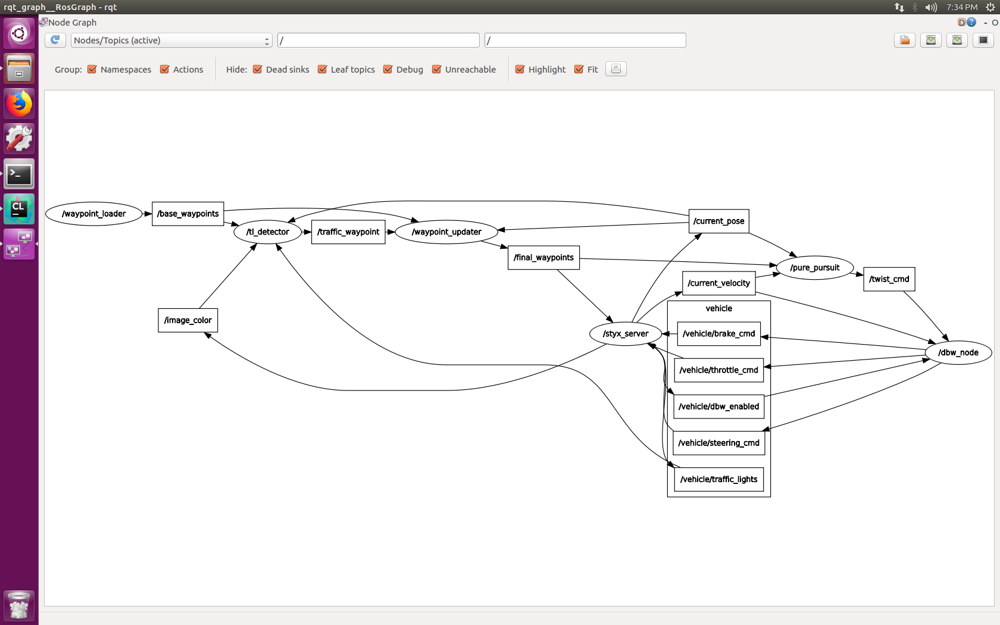

For this capstone project, I decided to do it on my own, for one thing I want to learn the whole thing more thoroughly, on the other hand I do not have much time to coordinate with others.

Here is the a view of the nodes & topics after all implementations.




[Here](./imgs/simulation_video.mov) is a video showing the ego car stops at Red traffic light and starts to move again on Green light.

---
### Below are the questions and notes I recorded during implementing the whole project.

* I meet this questions after i use: `sudo apt-get upgrade`:
Traceback (most recent call last):
  File "/opt/ros/kinetic/bin/catkin_make", line 13, in <module>
    from catkin.terminal_color import disable_ANSI_colors, fmt
  File "/opt/ros/kinetic/lib/python2.7/dist-packages/catkin/terminal_color.py", line 2, in <module>
    from catkin_pkg.terminal_color import *  # noqa
ImportError: No module named terminal_color
  * fix it with this command:
 `pip install --upgrade catkin_pkg_modules`
    and then I can catkin_make,no error happen

* ERROR: Cannot load message class for [styx_msgs/Lane]. Are your messages built?

  * Every time After opening a new terminal window, `sourcing devel/setup.bash`

* If you are running Linux on Virtual Machine, it is good to run the Unity simulator in host machine and set up the port forwarding to improve simulation performance, 
refer [here](https://s3-us-west-1.amazonaws.com/udacity-selfdrivingcar/files/Port+Forwarding.pdf).  

* Note that throttle values passed to publish should be in the range 0 to 1, although a throttle of 1 means the vehicle throttle will be fully engaged. Brake values passed to publish should be in units of torque (N*m). The correct values for brake can be computed using the desired acceleration, weight of the vehicle, and wheel radius.
  * Carla has an automatic transmission, which means the car will roll forward if no brake and no throttle is applied. To prevent Carla from moving requires about 700 Nm of torque or more.
  
* dbw_node.py is currently set up to publish steering, throttle, and brake commands at 50hz. The DBW system on Carla expects messages at this frequency, and will disengage (reverting control back to the driver) if control messages are published at less than 10hz. 

* Although the simulator displays speed in mph, all units in the project code use the metric system, including the units of messages in the /current_velocity topic (which have linear velocity in m/s).

* dbw_test  checksum error: ` [ERROR] [1555543501.502893651]: Client [/tl_detector] wants topic /base_waypoints to have datatype/md5sum [styx_msgs/Lane/d677da6803e261da968368ac6e143267], but our version has [waypoint_follower/lane/261462d438fc895bdf94163a0a9478a5]. Dropping connection. `
  * way to fix it the check sum error
    `rosbag fix --force <old.bag> <repaired.bag>`
    
* In order to help you acquire an accurate ground truth data source for the traffic light classifier, the Udacity simulator publishes the current color state of all traffic lights in the simulator to the /vehicle/traffic_lights topic in addition to the light location. This state can be used to generate classified images or subbed into your solution to help you work on another single component of the node. The state component of the topic won't be available when running your solution in real life so don't rely on it in the final submission. However, you can still reference this topic in real life to get the 3D world position of the traffic light.

* styx.launch is for testing in simulator
  * You have to launch the styx.launch then run the simulator, not the other way!!!!

* site.launch is for testing in vehicle on site

* How to show ros node graph 
  * `$rqt_graph`
  
* Why `rostopic echo /traffic_waypoint` no data
  * Because its publish method is written under image_cb, so to publish the data, you have to turn on the Camera in the simulator.
  
* '$rostopic echo /dbw_enabled' NO data 
  * /dbw_enabled has data, when you toggle the Manual check box in the simulator, you will see data : True / False;


---
## BELOW ARE ORIGINAL REPO INSTRUCTIONS
This is the project repo for the final project of the Udacity Self-Driving Car Nanodegree: Programming a Real Self-Driving Car. For more information about the project, see the project introduction [here](https://classroom.udacity.com/nanodegrees/nd013/parts/6047fe34-d93c-4f50-8336-b70ef10cb4b2/modules/e1a23b06-329a-4684-a717-ad476f0d8dff/lessons/462c933d-9f24-42d3-8bdc-a08a5fc866e4/concepts/5ab4b122-83e6-436d-850f-9f4d26627fd9).

Please use **one** of the two installation options, either native **or** docker installation.

### Native Installation

* Be sure that your workstation is running Ubuntu 16.04 Xenial Xerus or Ubuntu 14.04 Trusty Tahir. [Ubuntu downloads can be found here](https://www.ubuntu.com/download/desktop).
* If using a Virtual Machine to install Ubuntu, use the following configuration as minimum:
  * 2 CPU
  * 2 GB system memory
  * 25 GB of free hard drive space

  The Udacity provided virtual machine has ROS and Dataspeed DBW already installed, so you can skip the next two steps if you are using this.

* Follow these instructions to install ROS
  * [ROS Kinetic](http://wiki.ros.org/kinetic/Installation/Ubuntu) if you have Ubuntu 16.04.
  * [ROS Indigo](http://wiki.ros.org/indigo/Installation/Ubuntu) if you have Ubuntu 14.04.
* [Dataspeed DBW](https://bitbucket.org/DataspeedInc/dbw_mkz_ros)
  * Use this option to install the SDK on a workstation that already has ROS installed: [One Line SDK Install (binary)](https://bitbucket.org/DataspeedInc/dbw_mkz_ros/src/81e63fcc335d7b64139d7482017d6a97b405e250/ROS_SETUP.md?fileviewer=file-view-default)
* Download the [Udacity Simulator](https://github.com/udacity/CarND-Capstone/releases).

### Docker Installation
[Install Docker](https://docs.docker.com/engine/installation/)

Build the docker container
```bash
docker build . -t capstone
```

Run the docker file
```bash
docker run -p 4567:4567 -v $PWD:/capstone -v /tmp/log:/root/.ros/ --rm -it capstone
```

### Port Forwarding
To set up port forwarding, please refer to the [instructions from term 2](https://classroom.udacity.com/nanodegrees/nd013/parts/40f38239-66b6-46ec-ae68-03afd8a601c8/modules/0949fca6-b379-42af-a919-ee50aa304e6a/lessons/f758c44c-5e40-4e01-93b5-1a82aa4e044f/concepts/16cf4a78-4fc7-49e1-8621-3450ca938b77)

### Usage

1. Clone the project repository
```bash
git clone https://github.com/udacity/CarND-Capstone.git
```

2. Install python dependencies
```bash
cd CarND-Capstone
pip install -r requirements.txt
```
3. Make and run styx
```bash
cd ros
catkin_make
source devel/setup.sh
roslaunch launch/styx.launch
```
4. Run the simulator

### Real world testing
1. Download [training bag](https://s3-us-west-1.amazonaws.com/udacity-selfdrivingcar/traffic_light_bag_file.zip) that was recorded on the Udacity self-driving car.
2. Unzip the file
```bash
unzip traffic_light_bag_file.zip
```
3. Play the bag file
```bash
rosbag play -l traffic_light_bag_file/traffic_light_training.bag
```
4. Launch your project in site mode
```bash
cd CarND-Capstone/ros
roslaunch launch/site.launch
```
5. Confirm that traffic light detection works on real life images
